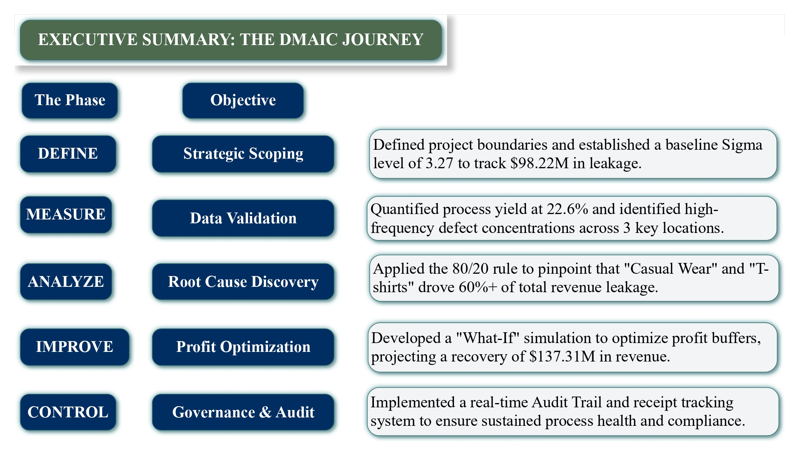
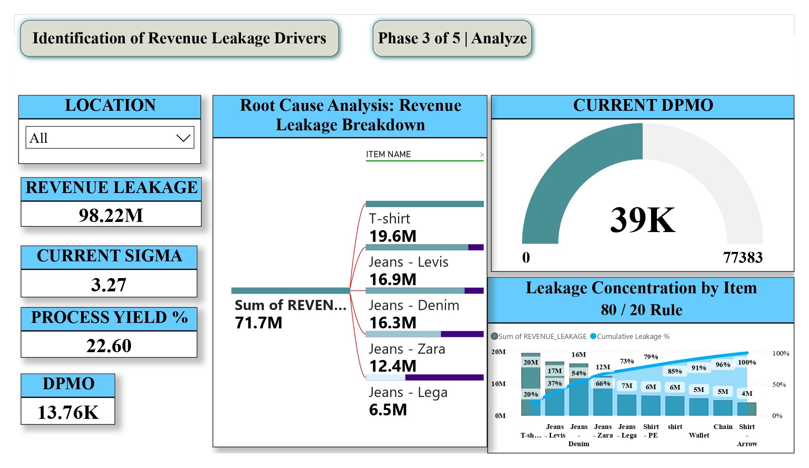
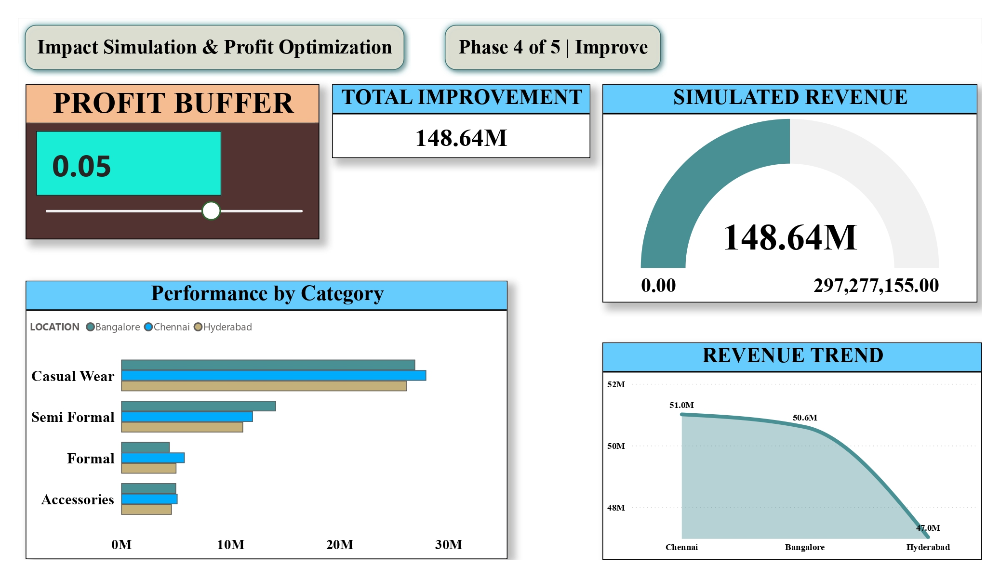

## 📊 Project Visualizations

### 1. Project Scoping & Baseline (Define Phase)
Shows the initial identification of $98.22M in revenue leakage and a 3.27 Sigma baseline.

### 2. Root Cause Discovery (Analyze Phase)
Utilizing the 80/20 rule to pinpoint high-frequency defect concentrations in Casual Wear.

### 3. Financial Optimization (Improve Phase)
A "What-If" simulation projecting a potential $137.31M revenue recovery.

